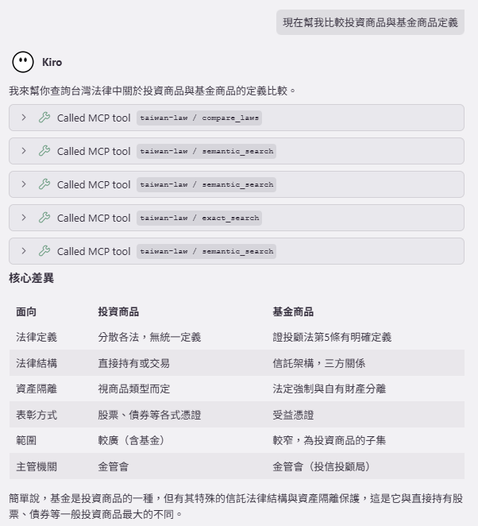

# 台灣法律 RAG MCP 系統 (Taiwan Law RAG MCP)

個人練習用的 RAG 專案，結合 FAISS 向量搜尋與 BM25 混合檢索，透過 MCP 協定讓 Claude 直接查詢台灣 48,000+ 條法律條文。

---

## 為什麼做這個？

台灣法律涵蓋 1,300+ 部法律、48,000+ 條條文，資料量龐大無法直接餵給 AI。身邊有人遇到加盟商糾紛，有感而發，決定以此為練習主題。

查詢分兩種情境：
- 知道條號 → 直接精確比對
- 只知道情境 → FAISS 向量搜尋 + BM25，RRF 融合 → Reranker 重排 → Top-10

---

## 系統架構

```
Claude Desktop / HTTP Client
     │  MCP                    │  HTTP
     ▼                         ▼
MCP Server (TypeScript)    FastAPI (Python, port 8073)
                                │
                    ┌───────────┼───────────┐
                 Embedding   Reranking   Generation
                 Provider    Provider    Provider
```

---

## 快速開始

**前置需求：** [uv](https://docs.astral.sh/uv/getting-started/installation/)

```bash
# 1. 初始化環境（建立 venv、安裝依賴、建立 .env）
uv run scripts/setup.py

# 2. 編輯 .env，設定 provider（見下方說明）

# 3. 建立索引（首次使用或切換 Embedding Provider 後必須執行）
uv run main.py index

# 4. 啟動服務
uv run main.py serve
```

啟動後輸出範例：
```
Taiwan Law RAG — http://127.0.0.1:8073
  ✓ Embedding  : voyageai:voyage-3.5-lite
  ✓ Reranking  : local:Qwen3-Reranker-4B
  ✗ Generation : ollama:qwen3:8b (unreachable)
```

> Generation 顯示 `unreachable` 時，搜尋功能仍可正常使用，只有 `/chat` 問答需要 LLM。

---

## Provider 設定

編輯 `.env`（`setup.py` 已自動從 `.env.example` 建立）。

**無 GPU（推薦）**
```env
EMBEDDING_PROVIDER=voyageai
RERANKING_PROVIDER=local
PROVIDER_API_KEY=你的 VoyageAI 金鑰
GENERATION_PROVIDER=openai
GENERATION_API_KEY=sk-...
```

**有 GPU（本地，不需要 API 金鑰）**
```env
EMBEDDING_PROVIDER=local
RERANKING_PROVIDER=local
GENERATION_PROVIDER=ollama
GENERATION_MODEL_NAME=qwen3:8b
```
> 本地 embedding 要跑很久，RTX 3060 12GB 跑了一天多 = =

完整 provider 選項與 `.env` 說明見 [docs/INSTALLATION.md](docs/INSTALLATION.md)。

---

## CLI 子命令

```bash
uv run main.py serve    # 啟動 FastAPI 服務
uv run main.py index    # 重建索引
uv run main.py eval     # 執行評估框架
uv run main.py check    # 驗證 provider 連線（不啟動服務）
```

---

## MCP 設定（Claude Desktop / Kiro）

在 `%APPDATA%\Claude\claude_desktop_config.json` 加入：

```json
{
  "mcpServers": {
    "taiwan-law": {
      "command": "node",
      "args": ["C:\\你的路徑\\taiwan-law-rag-mcp\\mcp-server\\dist\\index.js"],
      "env": { "RAG_API_URL": "http://localhost:8073" }
    }
  }
}
```

提供 6 個工具：`semantic_search`、`exact_search`、`search_law_by_name`、`get_law_full_text`、`compare_laws`、`ask_law_question`。

詳細使用範例見 [docs/USAGE.md](docs/USAGE.md)，API 文件見 [docs/API.md](docs/API.md)。

---

## 測試

```bash
uv run python -m pytest -v
```

---

## 實際範例


